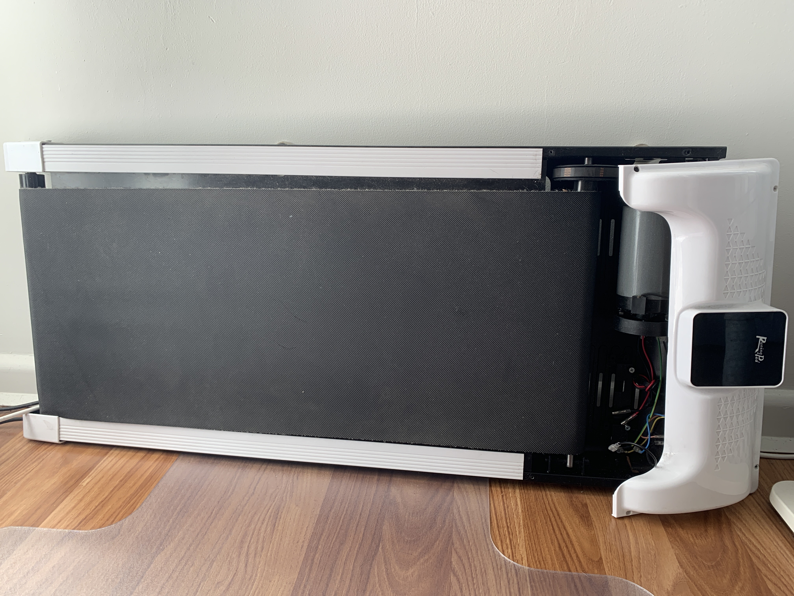

# Threadmill RE

This threadmill I found on the trash has two boards, let's call them: display and control. Both have STM8S ICs performing different functions. 

The display board, other than displaying numbers on the display (via discrete SMD LEDs), has a [proprietary 2.4GHz radio module][pmicro_web] which supposedly communicated with **a remote control that was not present at the dumping site (street) :/** ... thus, we have a reason to reverse, fix and having this working again for desk workouts :)



## Dumping firmware

Dumping firmware is (luckily) very straightforward because there's no ROP (Read Out Protection), so there's [no need to glitch the target][stm8_glitch]. Current OpenOCD 0.12.x from Homebrew fails to connect to the target, [perhaps it's just outdated][openocd_fail]:

```shell
openocd -f interface/stlink-dap.cfg -f target/stm8s105.cfg -c "init" -c "reset halt"
```

Fortunately, [stm8flash][stm8flash] does the job just fine out of the box:

### Display board

See actual file dumps under `display` folder in this repository. All interesting sections can be dumped with stm8flash successfully from its [`STM8S005K6T6C`][stm8s005k6t6c]:

```shell
% ./stm8flash -c stlinkv2 -p stm8s005k6 -s flash -r flash.bin
Determine FLASH area
STLink: v2, JTAG: v29, SWIM: v7, VID: 8304, PID: 4837
Due to its file extension (or lack thereof), "flash.bin" is considered as RAW BINARY format!
Reading 32768 bytes at 0x8000... OK
Bytes received: 32768

% ./stm8flash -c stlinkv2 -p stm8s005k6 -s eeprom -r eeprom.bin
Determine EEPROM area
STLink: v2, JTAG: v29, SWIM: v7, VID: 8304, PID: 4837
Due to its file extension (or lack thereof), "eeprom.bin" is considered as RAW BINARY format!
Reading 128 bytes at 0x4000... OK
Bytes received: 128

% ./stm8flash -c stlinkv2 -p stm8s005k6 -s ram -r ram.bin
Determine RAM area
STLink: v2, JTAG: v29, SWIM: v7, VID: 8304, PID: 4837
Due to its file extension (or lack thereof), "ram.bin" is considered as RAW BINARY format!
Reading 2048 bytes at 0x0... OK
Bytes received: 2048
```

### Control/motor board

Ditto for the control board, which has a smaller cousin, the [`STM8S003F3P6`][stm8s003f3p6] microcontroller:

```shell
% ./stm8flash -c stlinkv2 -p stm8s003f3 -s flash -r flash.bin
Determine FLASH area
STLink: v2, JTAG: v29, SWIM: v7, VID: 8304, PID: 4837
Due to its file extension (or lack thereof), "flash.bin" is considered as RAW BINARY format!
Reading 8192 bytes at 0x8000... OK
Bytes received: 8192

% ./stm8flash -c stlinkv2 -p stm8s003f3 -s eeprom -r eeprom.bin
Determine EEPROM area
STLink: v2, JTAG: v29, SWIM: v7, VID: 8304, PID: 4837
Due to its file extension (or lack thereof), "eeprom.bin" is considered as RAW BINARY format!
Reading 128 bytes at 0x4000... OK
Bytes received: 128

% ./stm8flash -c stlinkv2 -p stm8s003f3 -s ram -r ram.bin
Determine RAM area
STLink: v2, JTAG: v29, SWIM: v7, VID: 8304, PID: 4837
Due to its file extension (or lack thereof), "ram.bin" is considered as RAW BINARY format!
Reading 1024 bytes at 0x0... OK
Bytes received: 1024
```

[boot_attacks]: https://github.com/janvdherrewegen/bootl-attacks
[pmicro_web]: https://pmicro.com.cn/en/mcurf_/21.html
[stm8_glitch]: https://hackaday.com/2020/07/04/the-cheap-way-to-glitch-an-stm8-microcontroller/
[stm8flash]: https://github.com/vdudouyt/stm8flash
[openocd_fail]: https://github.com/hbendalibraham/stm8_started/issues/1#issuecomment-758252539
[stm8s003f3p6]: https://www.st.com/en/microcontrollers-microprocessors/stm8s003f3.html
[stm8s005k6t6c]: https://www.st.com/en/microcontrollers-microprocessors/stm8s005k6.html
