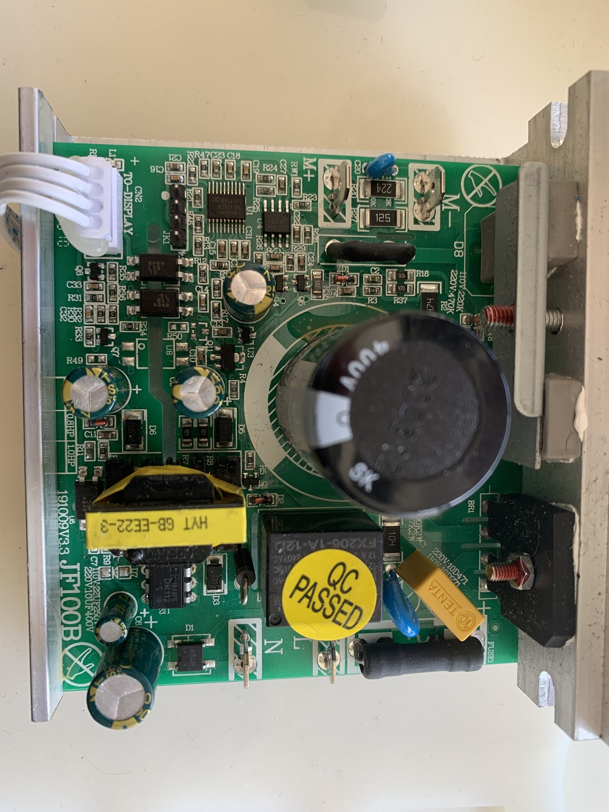
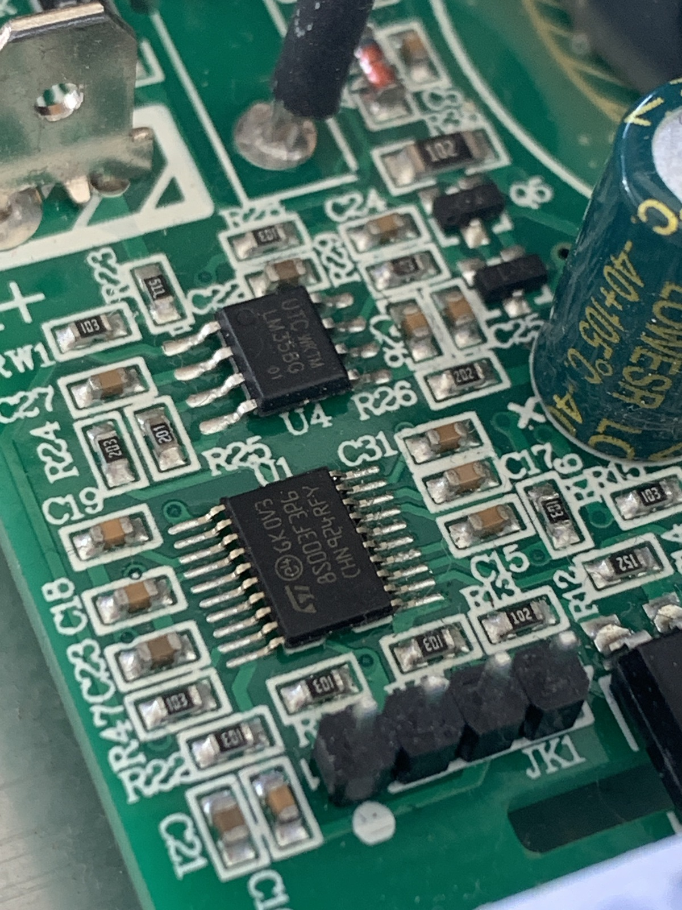

### Control/motor board

The [`STM8S003F3P6`][stm8s003f3p6] microcontroller can be dumped easily:

```shell
% ./stm8flash -c stlinkv2 -p stm8s003f3 -s flash -r flash.bin
Determine FLASH area
STLink: v2, JTAG: v29, SWIM: v7, VID: 8304, PID: 4837
Due to its file extension (or lack thereof), "flash.bin" is considered as RAW BINARY format!
Reading 8192 bytes at 0x8000... OK
Bytes received: 8192

% ./stm8flash -c stlinkv2 -p stm8s003f3 -s eeprom -r eeprom.bin
Determine EEPROM area
STLink: v2, JTAG: v29, SWIM: v7, VID: 8304, PID: 4837
Due to its file extension (or lack thereof), "eeprom.bin" is considered as RAW BINARY format!
Reading 128 bytes at 0x4000... OK
Bytes received: 128

% ./stm8flash -c stlinkv2 -p stm8s003f3 -s ram -r ram.bin
Determine RAM area
STLink: v2, JTAG: v29, SWIM: v7, VID: 8304, PID: 4837
Due to its file extension (or lack thereof), "ram.bin" is considered as RAW BINARY format!
Reading 1024 bytes at 0x0... OK
Bytes received: 1024
```



