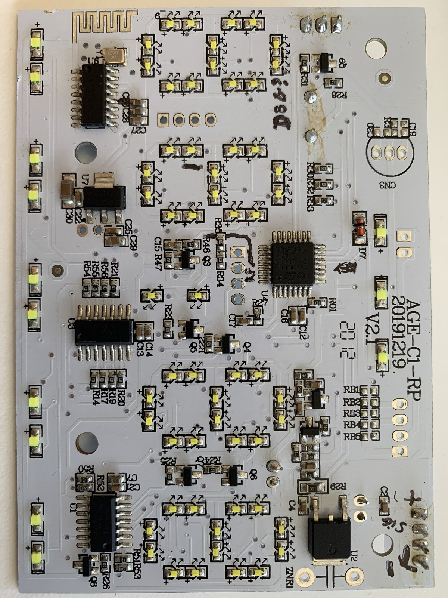
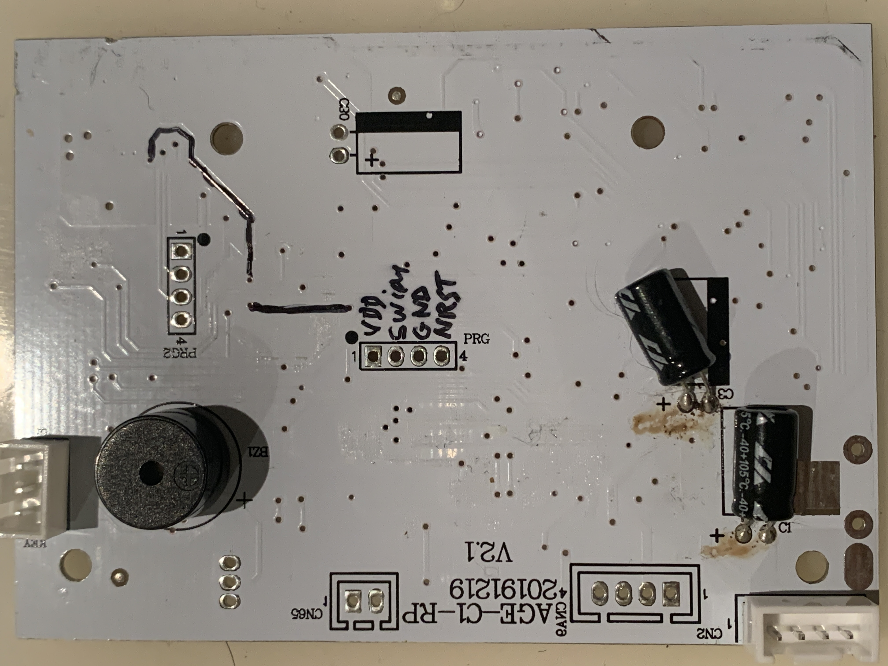
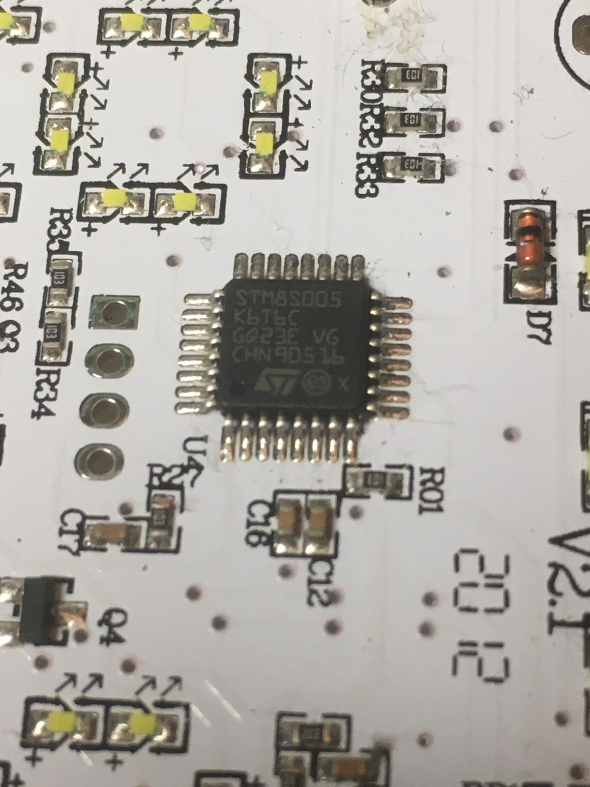

# Display board

All interesting sections can be dumped with stm8flash successfully from its [`STM8S005K6T6C`][stm8s005k6t6c]:

```shell
% ./stm8flash -c stlinkv2 -p stm8s005k6 -s flash -r flash.bin
Determine FLASH area
STLink: v2, JTAG: v29, SWIM: v7, VID: 8304, PID: 4837
Due to its file extension (or lack thereof), "flash.bin" is considered as RAW BINARY format!
Reading 32768 bytes at 0x8000... OK
Bytes received: 32768

% ./stm8flash -c stlinkv2 -p stm8s005k6 -s eeprom -r eeprom.bin
Determine EEPROM area
STLink: v2, JTAG: v29, SWIM: v7, VID: 8304, PID: 4837
Due to its file extension (or lack thereof), "eeprom.bin" is considered as RAW BINARY format!
Reading 128 bytes at 0x4000... OK
Bytes received: 128

% ./stm8flash -c stlinkv2 -p stm8s005k6 -s ram -r ram.bin
Determine RAM area
STLink: v2, JTAG: v29, SWIM: v7, VID: 8304, PID: 4837
Due to its file extension (or lack thereof), "ram.bin" is considered as RAW BINARY format!
Reading 2048 bytes at 0x0... OK
Bytes received: 2048
```





