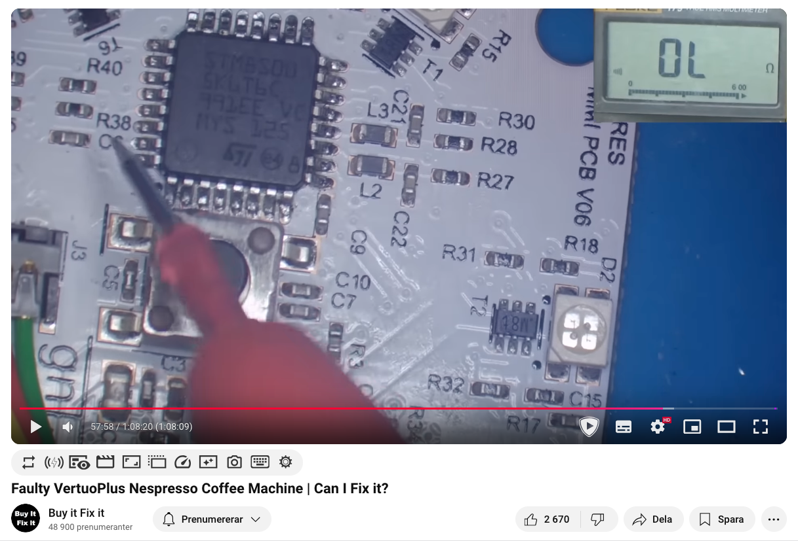

<!-- Inline CSS to override uppercase styling -->

<!-- Slide 1: Hello and welcome -->

# Running over STM8
## by pancake & brainstorm

Note:
Hello and welcome to our presentation where we explore the depths of STM8, a microcontroller from ST Microelectronics.

The title of this presentation was chosen by Sergi (pancake) based on the fun
we had working together.

---
# Agenda

1. STM8: What is this?
1. STM8: Motivation
1. STM8: e-waste target
1. STM8: PCBs reversing
1. STM8: radare2 improvements
1. LLMs: r2ai's decai for firmware decompilation
1. SVD: Improvements outside r2land
1. Conclusion
1. Future

Note:
So, today we'll very briefly see why it is important to fix and improve the STM8 support in radare2, I will show a couple of tricks to productively reverse engineer the circuit schematic for our particular hardware target and we'll also see how Large Language Models (so-called AI nowadays) assisted in generating great decompilation that outperforms most traditional decompilers through r2ai and decai.

---
## STM8

> The STM8 is an **8-bit microcontroller family by STMicroelectronics**. 

> The STM8 microcontrollers use an extended variant of the ST7 microcontroller architecture. STM8 microcontrollers are particularly **low cost for a full-featured 8-bit microcontroller**.

Note:
So in the interest of time, I'll not deep dive into the particular features of this 8-bit microcontroller, any of you can look this up fast by your favourite search engine or AI bot, so I'll not entertain the fine details of this 8 bit microcontroller in this presentation. I'll just say that it is very common as it is very price competitive given its features so it can be found in many consumer devices nowadays.
---

https://www.youtube.com/watch?v=1xROsl_59LY

Note:
But, which consumer devices you might wonder? Well, here's your typical and cheap tankless water heater running on a STM8 aѕ this teardown video from DiodeGoneWild shows. Most common functions that our low power microcontroller does are: controlling the power regime of IGBT transistors, driving peripherals such as LCD screens and reading values from sensors such as NTC temperature probes and other boards connected to I2C buses to name a few.

---

https://www.youtube.com/watch?v=8xZH0ccpOas

Note:
Not convinced about how common this thing is in the wild yet? Here's another youtuber, "Buy it, Fix it" showcasing a broken Nespresso coffee machine, where the STM8 microcontroller decides if you will have coffee today or not. That particular board will also flash some LEDs to inform you while sending some commands to the rest of the appliance... oh, by the way, every appliance can have many STM8 microcontrollers integrated inside talking to each other... by now you should start seeing the amount of chips running our everyday lives: possibly more than windows and linux installs combined? Food for thought!

---

Note:
Here's another example that literally hits home: this is my current washing machine. Of course I opened it up for this presentation!
---

Note:
Funny spring touch capacitive buttons, but what MCU is running this whole show?
---

Note:
Indeed, another STM8 inside!
---

Note:
Here's a drier from a friend's place.
---

Note:
If appliances could talk and you watch them closely...
---

Note:
... they ask to be reverse opened and engineered!
---

Note:
Jokes aside, I think it's important to have sharp tools like radare2 to reverse engineer and eventually repair any and all devices that you own (or find in the dumpster).
---
### today's e-waste: a treadmill

Note:
I found this on the trash, it contains a couple of PCBs with two different models of STM8 microcontrollers, we'll see in detail later.
---

## Motivation

https://github.com/radareorg/radare2/issues/16498

Note:
A couple of innocent comments and examples on how radare2's stm8 support was broken
---

Note:
Then one fine morning, a man showed up with breakfast on his head and told me I was presenting on an international reverse engineering conference.

---
### Challenges

* No remote (RF) controller found. No sniffing 👃.
* No idea if this devіce **works** to begin with.
* Mains voltage == 💀 if not careful.
* Very limited time (and space).

Let's goooo anyway! 💪

Note:
Why sniffing will not save you here: no remote found when I found this... more on PCB reveng later.

---
# Try Ghidra?

Note:
LLMs: Not much point in considering GhidrOllama if the decompilation is not trusted: https://github.com/lr-m/GhidrOllama 
---
### Ghidra's STM8 support

https://github.com/esaulenka/ghidra_STM8/issues/11

---
### Ghidra's ~STM8~ ST7 support

https://github.com/NationalSecurityAgency/ghidra/pull/3631

Note:
Ghidra state of the art: STM8 not part of the standard distribution, stalled threads of ST7 and STM8 support. Fails with "input varnodes" error on the second biggest function.
---
### Binary Ninja?

---
### PCB: display

---
### Display PCB annotated

---
### Display PCB: 2.4Ghz RF module

---
### PL51WT020

Note:
RF: Who knows the 2.4Ghz code(s) that it accepts?
Would be fun to play with: https://charliegerard.dev/blog/replay-attacks-javascript-hackrf/
---
### PCBs reversing: control

---
### Control PCB components

---
### OSS PCB reversing with KiCad ...

---
### For the "display" board ...

---
### ... and the "control" board

---
### Boards against sunlight

---
### Find landmarks and align...

Note:
So, as we've seen, with gimp we can figure out where tracks snake across layers and figure out the interconnection of components faster than just relying on direct visual inspection and a digital multimeter.
---
### ... to meld them with GIMP

---
### Add Python-Fu if you like

https://gist.github.com/brainstorm/ad3824f03fac986cd1e34d62ea49ea76
---
<!-- TODO: Insert videoclip here using GIMP -->
<!--(add GIMP tricks w/ opacity and script here)-->
<!-- https://gist.github.com/brainstorm/ad3824f03fac986cd1e34d62ea49ea76 -->

https://hackaday.com/2020/09/01/perfect-photographs-for-pcb-reverse-engineering/

---
## radare2 and LLMs: decai.r2js

---
## pdc: PseuDo C

---
## "Simple" decai -d

---
## Improved decai -d

---
## Calling conventions? decai -s

---

### STM8 support radare2 PRs

https://github.com/radareorg/radare2/pull/23552
https://github.com/radareorg/radare2/pull/23541
https://github.com/radareorg/radare2/pull/23526
https://github.com/radareorg/radare2/pull/23517
https://github.com/radareorg/radare2/pull/23305
https://github.com/radareorg/radare2/pull/23411
https://github.com/radareorg/radare2/pull/23251
https://github.com/radareorg/radare2/pull/23542
https://github.com/radareorg/radare2/pull/23030
https://github.com/radareorg/radare2/pull/23244
https://github.com/radareorg/radare2/pull/23486
https://github.com/radareorg/radare2/pull/23509
https://github.com/radareorg/radare2/pull/23543
https://github.com/radareorg/radare2/pull/23548

---
# r2svd

---
# cmsis-svd maintainers 🚀

---

### PRs against radare2-extras and r2ai
https://github.com/radareorg/r2ai/pull/66

https://github.com/radareorg/r2ai/pull/65

<!--
https://github.com/radareorg/radare2/commit/1744c8863be0985ed282454ada1e2432d0868e05

https://github.com/radareorg/radare2-extras/commit/49a91651d25c983a9869def874a690c9a223950f

https://github.com/radareorg/radare2-extras/commit/ef93ab4c9166828a286ec765deee7f616774f525
-->

https://github.com/radareorg/radare2-extras/pull/370

https://github.com/radareorg/radare2-extras/pull/364

---
# Conclusion

* r2 is top notch if you need to do a STM8 analysis.
* Decompilation via LLMs is surprisingly good.
* This is just the start, no RAG, r2 "zignatures", fine tuning...
* Other radare2 areas were improved too as a result of this work: XREFs, r2 projects, etc...
* Most important: Me and pancake had tons of fun with this :)

---
# I have a dream...

* Dump (automate STM8 glitching too if protected).
* Generate r2 "zignatures" database of the ST's official stdlib, fine tuned with a local LLM model.
* Output a C project with all relevant files, peripherals, makefile included. 
* Requiring minimal manual tweaking needed on the output code.
* Compile it all with SDCC and free your STM8 powered devices.
---
# ... and a competition!

Want to win r2con 2024 swag?

> Submit an issue to the repo 👇 with a writeup detailing which secret commands move the treadmill motor.

---
